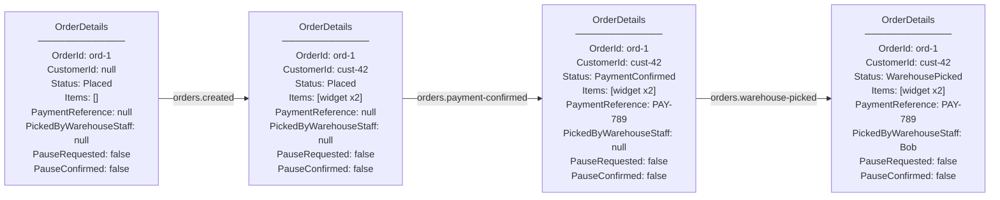
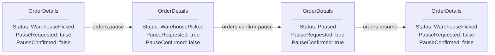
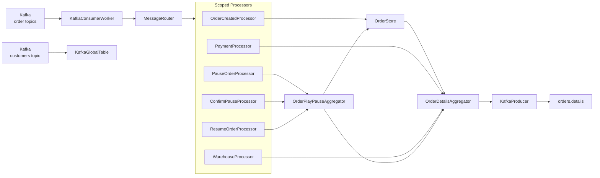

# Order Service

A C# Kafka microservice that consumes order fulfillment events from multiple independent systems, progressively enriches an `OrderDetails` aggregate, and publishes the combined state to an output topic.

## Architecture

### Message Flow

```
orders.created           →  OrderCreatedProcessor   →  OrderStore.UpdateAsync()
                                                              ↓ (caches base order, then calls)
                                                        OrderDetailsAggregator.UpdateOrderAsync()

orders.payment-confirmed →  PaymentProcessor         →  OrderDetailsAggregator.AddPaymentReferenceAsync()

orders.warehouse-picked  →  WarehouseProcessor       →  OrderDetailsAggregator.AddWarehousePickAsync()

orders.pause             →  PauseOrderProcessor      →  OrderDetailsAggregator.SetPauseRequestedAsync()

orders.confirm-pause     →  ConfirmPauseProcessor    →  OrderDetailsAggregator.SetPauseConfirmedAsync()

orders.resume            →  ResumeOrderProcessor     →  OrderDetailsAggregator.ResumeOrderAsync()

All six paths publish the latest OrderDetails to orders.details (key = order ID)
```

### OrderDetails Progressive Enrichment

Each event fills in one more piece of the aggregate. Fields are null until the corresponding event arrives.

#### Fulfillment Path



#### Pause / Resume Path



Note: `orders.pause` alone does not change the status — the order is only `Paused` once both pause messages have arrived. `orders.resume` clears both flags regardless of which pause messages had been received.

### Dependency Diagram



### Components

| Component | DI Lifetime | Role |
|---|---|---|
| `KafkaConsumerWorker` | Singleton (HostedService) | Consume loop — polls Kafka, delegates to MessageRouter |
| `MessageRouter` | Singleton | Creates a DI child scope per message, resolves keyed processor |
| `OrderCreatedProcessor` | Scoped (keyed: "orders.created") | Handles new order events, delegates to OrderStore |
| `PaymentProcessor` | Scoped (keyed: "orders.payment-confirmed") | Handles payment confirmation events |
| `WarehouseProcessor` | Scoped (keyed: "orders.warehouse-picked") | Handles warehouse pick events |
| `PauseOrderProcessor` | Scoped (keyed: "orders.pause") | Records pause intent |
| `ConfirmPauseProcessor` | Scoped (keyed: "orders.confirm-pause") | Confirms pause — triggers Paused status when combined with pause |
| `ResumeOrderProcessor` | Scoped (keyed: "orders.resume") | Clears pause flags, restores derived status |
| `OrderStore` | Singleton | Caches base order payload from orders.created |
| `OrderDetailsAggregator` | Singleton | Aggregates all order events, derives Status, publishes to orders.details |
| `KafkaProducer` | Singleton | Wrapper around Confluent.Kafka IProducer |
| `KafkaGlobalTable` | Singleton (HostedService) | Consumes a compacted topic into an in-memory lookup table |

### Scope-Per-Message Pattern

There is no automatic DI scope in a `BackgroundService` (unlike ASP.NET where each HTTP request creates one). The `MessageRouter` creates a child scope for every Kafka message:

1. `KafkaConsumerWorker` consumes a message and calls `MessageRouter.RouteAsync()`
2. `MessageRouter` creates a child scope via `ILifetimeScope.BeginLifetimeScope()`
3. The correct `IMessageProcessor` is resolved from the child scope using the topic name as a key
4. `ProcessAsync` runs — the processor and its scoped dependencies live inside this child scope
5. The child scope is disposed — the processor and all scoped dependencies are cleaned up

Scoped processors can depend on singleton services (e.g., `OrderDetailsAggregator`), but not the reverse.

## High Availability

### Strategy: Co-Partitioned Topics (Active-Active with Partitioned Ownership)

This service runs active-active at the **service level** — all instances are running and processing simultaneously. However, at the **product level**, each product is owned by exactly one instance at a time. This is active-active with partitioned ownership, not true active-active (where any instance can handle any product at any time).

Multiple instances share the same consumer group, and Kafka distributes partitions across them. When an instance fails, Kafka rebalances its partitions to surviving instances. There is a brief consumption pause during rebalancing for the affected partitions.

### Why Co-Partitioning

`OrderDetailsAggregator` holds in-memory state that is built up from all six order topics. For the combined `OrderDetails` to be correct, a single instance must see **all** events for a given order.

Co-partitioning guarantees this: when all six order topics have the same partition count and use order ID as the key, Kafka's default partitioner hashes the key identically across topics. Partition N of each topic contains the same set of order IDs. Since all topics are in the same `Subscribe()` call and consumer group, Kafka assigns matching partition numbers to the same instance.

```
Instance A: partition 0 of all six order topics (all events for orders hashing to partition 0)
Instance B: partition 1 of all six order topics (all events for orders hashing to partition 1)
```

All events for a product land on the same instance. The in-memory state is complete per-instance.

### Co-Partitioning Requirements

These are **mandatory** for correctness. Violating them will cause instances to produce incomplete product details.

1. **All six order topics must have the same number of partitions.** If you change one, you must change the others.
2. **All topics must use order ID as the message key.** The default partitioner hashes the key to assign partitions — same key means same partition number.
3. **All topics must use the same partitioner.** Use Kafka's default (murmur2) for all. Do not override the partitioner on producers for any topic.

### Alternatives Considered

**Externalized state (Redis/database):** All instances read/write shared external state. Rejected because it adds a network dependency on every message and a new infrastructure component to manage, when co-partitioning solves the problem with zero code changes and zero additional infrastructure.

**KafkaGlobalTable for product details:** Each instance publishes partial updates and consumes the full topic to rebuild complete state. Rejected because it introduces eventual consistency (stale reads during propagation), race conditions on concurrent merges, amplified Kafka I/O (every update consumed by every instance), and full dataset memory usage per instance. Co-partitioning gives immediate consistency with simpler logic.

### Scaling

Set the partition count equal to your expected maximum instance count. Each partition can be consumed by at most one instance, so extra instances beyond the partition count will be idle. Partitions can be added later but **cannot be removed** — avoid over-provisioning.

### Consumer Count vs Partition Count

Having fewer consumers than partitions is valid — a single consumer will read all assigned partitions, polling them round-robin. This is the standard scale-out model: partitions represent reserved capacity that becomes useful as you add instances.

Having more consumers than partitions means the excess consumers sit idle, receiving no partition assignment. This is wasteful but not harmful.

**Example:** 1 instance with 3 partitions — the single instance owns all 3 partitions and processes all messages. Throughput is limited to that one instance, but you can scale to 3 instances without any topic reconfiguration.

### At-Least-Once Delivery and Manual Offset Commits

Kafka tracks a consumer's progress via **committed offsets** — a saved position per partition that tells Kafka where to resume after a restart or rebalance. By default, Confluent.Kafka commits offsets automatically on a background timer, independently of whether processing actually finished. That is unsafe for any message that produces a side effect (such as publishing to another Kafka topic): the offset can be committed before the side effect completes, meaning a crash at that point causes the side effect to be silently lost.

This service disables auto-commit (`EnableAutoCommit = false`) and calls `consumer.Commit(result)` manually in `KafkaConsumerWorker`, immediately after `RouteAsync` returns. `RouteAsync` only returns after the processor — and every Kafka produce inside it — has completed. The sequence is therefore:

```
1. Consume message
2. Run processor (state mutation + any Kafka produces)
3. consumer.Commit(result)   ← offset saved to Kafka
```

If the instance dies at step 2 (before the commit), the offset was never saved. The next instance re-reads from the last committed position and reprocesses the message, re-running all side effects. This is **at-least-once delivery**.

**The tradeoff:** if the instance dies between step 2 and step 3 (processing done, commit not yet saved), the message is reprocessed and side effects execute a second time. Consumers of `orders.alerts` and any other output topic must therefore be **idempotent** — processing the same message twice must produce the same result as processing it once.

If processing throws an exception, `Commit` is skipped. The offset does not advance and the message will be reprocessed on the next poll. This is intentional: a failed message is not silently skipped.

### Pause State and Instance Failover

The pause flow requires two messages — `orders.pause` followed by `orders.confirm-pause` — before an order becomes `Paused`. This two-step design raises an HA question: what happens if the instance that processed `orders.pause` fails before `orders.confirm-pause` arrives?

**Solution: `orders.pause` GlobalTable**

`OrderPlayPauseAggregator` does **not** hold pause timestamps in a local dictionary. Instead, it reads them from a `KafkaGlobalTable<string, string>` that continuously consumes the `orders.pause` topic. This GlobalTable uses a separate consumer group (`my-service-global-pause`) so that **all instances consume all partitions** on startup and maintain a complete copy of every pause timestamp at all times.

**Failover behaviour:**

1. Instance A processes `orders.pause` for order `ord-1` — the GlobalTable on every instance (including B and C) already has the timestamp because they all independently consume the `orders.pause` topic.
2. Instance A fails. Kafka detects the dead consumer and rebalances `ord-1`'s partition to Instance B (rebalance typically completes in 2–3 seconds).
3. Instance B receives the `orders.confirm-pause` for `ord-1`. It looks up the pause timestamp from its own GlobalTable — the timestamp is there. Validation passes and the order is paused correctly.

**Why the wall-clock guard remains valid:**

`orders.confirm-pause` is rejected if its `CreatedAt` timestamp is more than 10 seconds old. Kafka rebalance completes in 2–3 seconds — well within the 10-second window — so a valid in-flight confirm-pause will still pass after Instance B takes over the partition.

**The OrderPaused alert under failover:**

On successful pause confirmation, `OrderPlayPauseAggregator` publishes an `OrderAlert` to `orders.alerts` before returning. Because the consumer offset is only committed after the method returns (see "At-Least-Once Delivery" above), a crash between the alert produce and the offset commit causes the `orders.confirm-pause` message to be reprocessed by the next instance. That instance re-validates (GlobalTable has the pause timestamp), re-pauses the order, and re-sends the alert. The alert may therefore arrive twice on `orders.alerts` — consumers must be idempotent.

**Tombstone on resume:**

When `ResumeAsync` runs, after clearing the pause flags it produces a **tombstone** (a message with a null value) to the `orders.pause` topic keyed by order ID. Because `orders.pause` is a compacted topic, the `KafkaGlobalTable` on every instance processes the tombstone and removes that order ID's entry from its in-memory state.

This closes a race window: a stale `orders.confirm-pause` that arrives after the resume would otherwise pass guard 2 (which reads the GlobalTable to find the original pause timestamp) and incorrectly re-pause the order. With the tombstone in place, `pauseGlobalTable.Get` returns `null` for that order ID, guard 2 rejects the message, and the stale confirm-pause is silently discarded.

A new `orders.pause` after a resume re-adds the entry to the GlobalTable and starts a fresh pause cycle normally.
